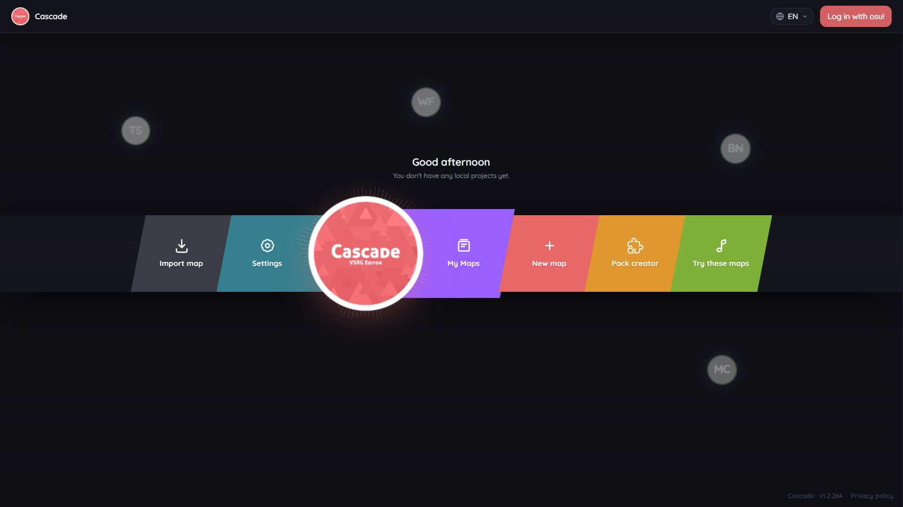
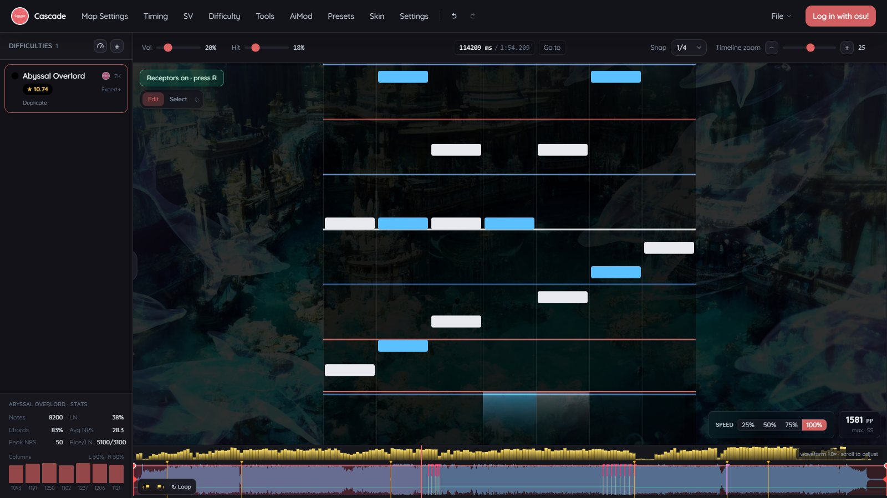
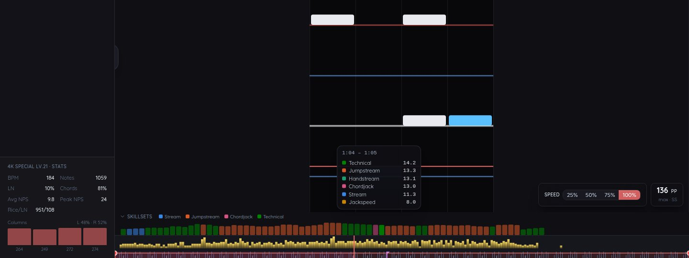
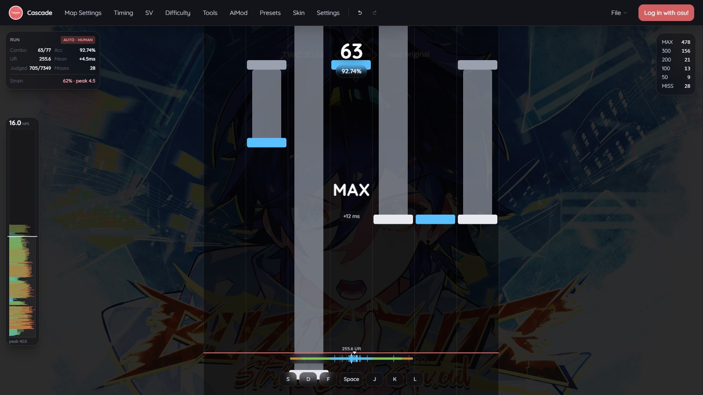
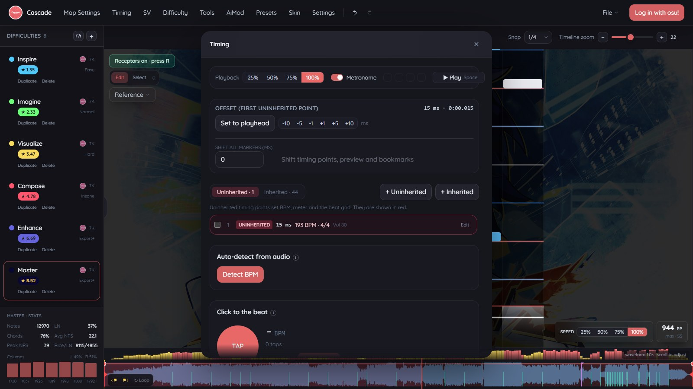
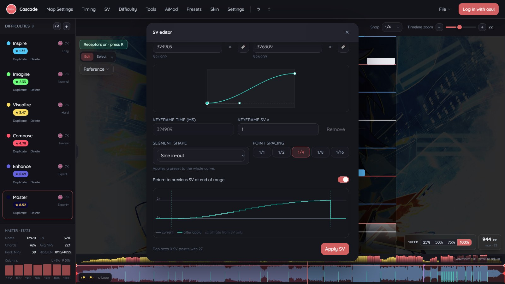
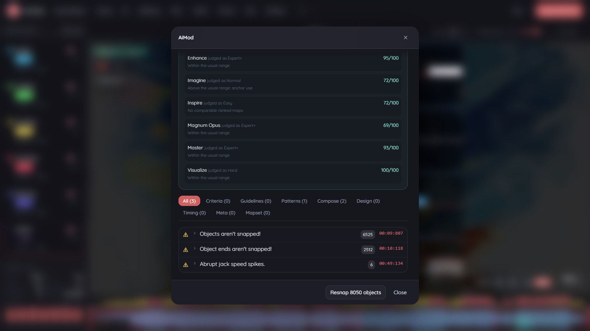
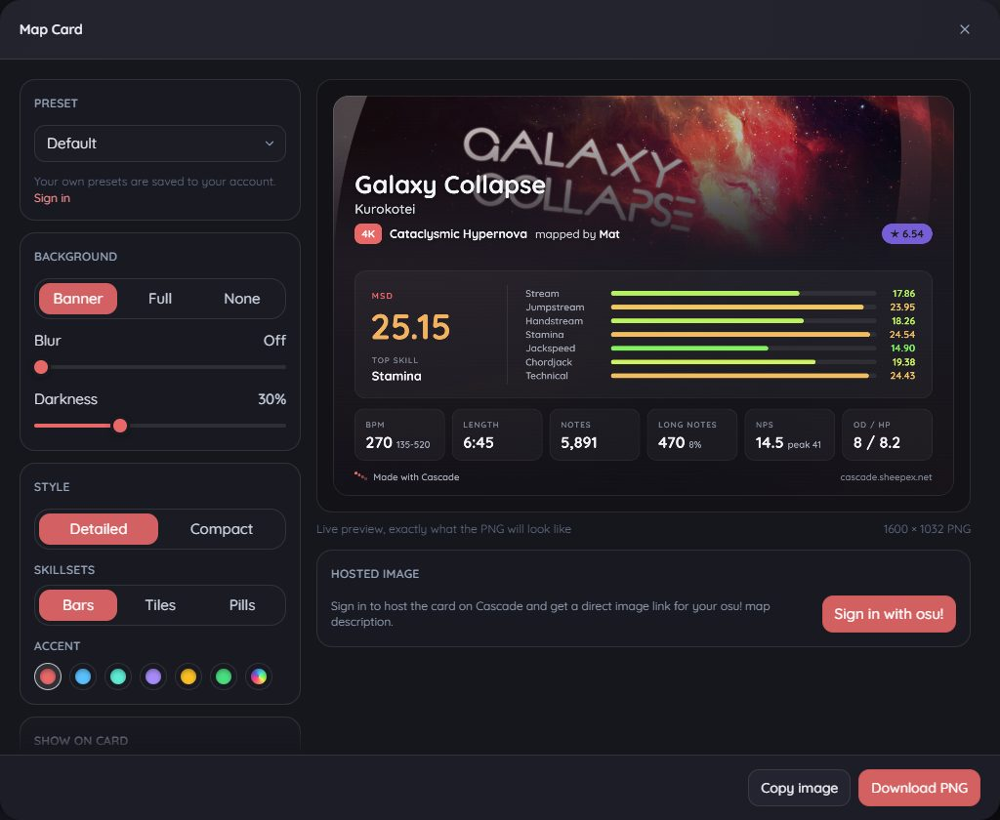
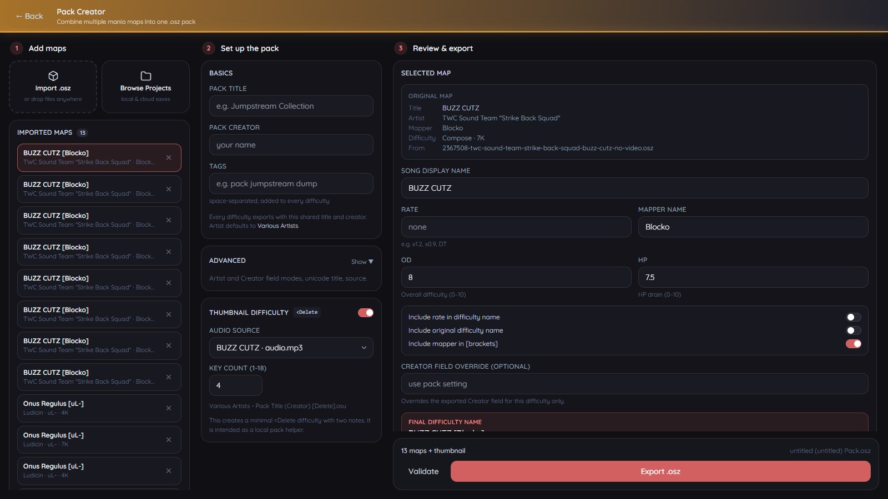
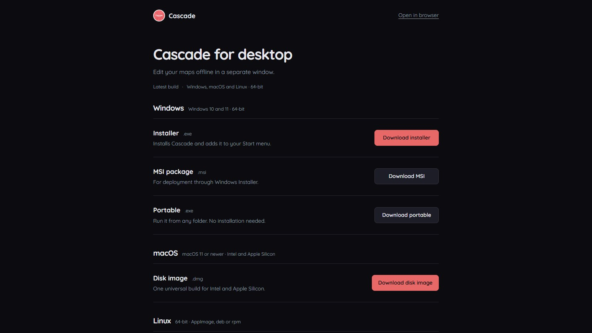

# Cascade

Cascade is a beatmap editor for vertical scrolling rhythm games (VSRG) that runs in the browser. It is built around osu!mania and also reads and writes StepMania, Etterna, Quaver and Malody charts.

- Browser editor: https://cascade.sheepex.net
- Desktop app for Windows, macOS and Linux: https://cascade.sheepex.net/download
- Map Card, a shareable image of your map's stats and MSD skillsets: https://cascade.sheepex.net/osu-mania-map-card



*The main menu. The background and the song in the now playing widget come from a project saved in this browser.*

## What Cascade is

Cascade lets you time a song, chart it, play it, check it and export it in one place. You can start from a blank project, open an existing `.osz`, `.osu`, `.sm`, `.ssc`, `.qua`, `.mc` or `.mcz` file, or load one of the sample maps from the main menu.

You do not need to install anything or create an account. Projects are saved in your browser on your device. Logging in with osu! adds cloud saves, settings sync, realtime collaboration and public share links.

The same editor is also available as a desktop app built with Tauri. On Windows, the desktop app can also work with your osu! installation directly.

The main menu plays a random song from your local projects, and the logo reacts to its beat. Press C to pause, V to skip and X to go back.

Mapping needs a keyboard and a mouse. On a phone, Cascade shows an overview page and asks you to open it on a computer.

## Feature overview

| Area | What it covers |
| --- | --- |
| [Editing](#editing) | 1K to 18K charts, rice and long notes, snap or free placement, waveform timeline, multiple difficulties, live stats |
| [Playtest](#playtest) | Play the chart you are editing with F5, using osu!mania judgements, UR and a hit error bar |
| [Timing and audio](#timing-and-audio) | Red and green points, tap tempo, BPM detection, metronome, offset calibration |
| [Scroll velocity](#scroll-velocity) | Constant, curve and stutter SV with a preview before you apply |
| [Checks and mapping tools](#checks-and-mapping-tools) | AiMod report, export validation, resnapping, note suggestions, pattern presets |
| [Map Card](#map-card) | A shareable image of a difficulty's stats and MSD skillsets, with a direct link for osu! descriptions |
| [Import and export](#import-export-and-pack-creator) | osu!mania, StepMania, Etterna, Quaver and Malody formats, osu! links, Pack Creator |
| [Accounts and collaboration](#accounts-cloud-collaboration-and-sharing) | osu! login, cloud projects, realtime collaboration, comments, public share links |
| [Desktop app](#desktop-app) | Project folder on disk, version history, file associations, osu! integration on Windows |

## Editing



*The Master difficulty of a 7K sample mapset. The difficulty list is sorted by star rating, and the panel below it shows stats for the active difficulty.*

### Playfield

- Canvas-based editor for 1K to 18K charts with rice notes and long notes.
- Snap divisors up to 1/16, or free placement. Number keys change the snap, and 0 switches to free placement.
- Smooth scrolling that glides between snap lines instead of jumping.
- Waveform timeline at the bottom with BPM, SV, kiai, preview point and bookmark markers. Press W to also draw the waveform over the lanes, which helps when checking offset.
- Receptors (R), zen mode (Tab) to hide every panel, and a hitsound edit mode (H).
- A reference view that shows another difficulty next to the one you are editing.
- Upscroll or downscroll, background dim, note height, long note body width, interface scale and a performance mode for slower machines. These only change what you see in the editor.
- Colourblind-friendly lane colours in Settings → Editor. The default skin switches to white, orange and sky blue, which stay distinct with the common kinds of colour blindness.
- Colour notes by snap, also in Settings → Editor. Each note takes the colour of the beat line it sits on (1/2 red, 1/4 blue, 1/3 purple and so on), and notes off the grid turn dark grey, so a stray snap stands out without running AiMod. It only changes the editor; playtest keeps your skin.

### Difficulties and stats

- Any number of difficulties per mapset. Add new ones, duplicate, rename with a double-click, or select several and delete them together.
- The rate changer creates a new difficulty at a different playback rate. It can preserve pitch and put the rate or BPM in the difficulty name.
- Stats for the active difficulty: note count, long note share, chord share, average and peak NPS, rice and long note counts, and notes per column with the split between left and right hand.
- A star rating on every difficulty and a max pp readout that update as you map.
- A skillset graph above the bottom timeline shows which skillset makes each part of the song hard: stream, jumpstream, handstream, jackspeed, chordjack or technical. Bar height is how hard that moment is. Hover a bar for all six values, or click it to jump there. It uses Etterna's MinaCalc, so it rates 4K, 6K and 7K maps. It starts minimised; the arrow next to "Skillsets" opens and closes it, and Settings → Editor turns it off.



*Each bar is coloured by the skillset that leads at that moment. The tooltip lists all six ratings for the part of the song under the cursor.*

### Audio and media

- MP3 or OGG audio, a background image for the whole set or a single difficulty, and an optional muted background video that plays behind the playfield.
- Playback speed presets of 25%, 50%, 75% and 100%. Hold S while the song plays to slow down to 25%.
- Trim brackets and fades on the timeline. The original audio stays untouched in the project, and the cut is only applied when you export an `.osz`.
- Right-click the timeline to set the preview point or add a named bookmark. With two bookmarks set, the Loop button repeats that section.
- Local projects are saved with Ctrl+S, or automatically with autosave turned on. They include audio, difficulties and background files.

### Selection and patterns

- Cut, copy and paste with undo, redo and an undo history list.
- Clipboard and pasteboard history. Drag an entry onto the playfield to paste it at that time and lane.
- Mirror, reverse or shuffle a selection, or halve or double its spacing.
- Copy a selection as a PNG image, with long notes and timing labels, to share a pattern in chat.
- A command palette (Ctrl+K) that runs any action by name.

### Shortcuts

Default bindings. Single-key shortcuts can be rebound in Settings, under Shortcuts. Ctrl combinations are fixed.

| Key | Action |
| --- | --- |
| Space | Play or pause |
| Hold S | Slow playback to 25% while held |
| F5 | Enter or leave playtest |
| Ctrl+Z, Ctrl+Shift+Z | Undo, redo |
| Ctrl+S | Save locally |
| Ctrl+K | Command palette |
| Ctrl+G | Jump to a time |
| Ctrl+Shift+C | Copy the selection as an image |
| 1 to 8, 0 | Change the snap, free placement |
| B, Page Up, Page Down | Add a bookmark, jump to the previous or next one |
| R, Tab, H, W | Receptors, zen mode, hitsound mode, waveform overlay |
| M, F, S | Mirror, reverse or shuffle the selection |
| [ and ] | Halve or double the spacing of the selection |
| W, F, C in hitsound mode | Toggle whistle, finish or clap on the selection |
| T with the Timing window open | Tap tempo |
| Alt + mouse wheel | Resize the interface (can be changed to timeline zoom, playfield size or volume) |

## Playtest



*Humanized autoplay running on the same difficulty. Run stats are in the top left, judgement counts in the top right, the density graph on the left edge, and the hit error bar and key overlay at the bottom.*

Press F5 to play the chart you are editing from the current position. You do not need to export or import anything first. Press F5 again to return to the editor where you stopped.

Gameplay follows osu!lazer's mania ruleset, taken from its source rather than approximated:

- **Judgement windows** come from the difficulty's OD, as lazer's `ManiaHitWindows` computes them (MAX narrows with OD too). A note you have not hit misses once it is later than the 50 window; pressing between the 50 and miss windows early is an early miss.
- **Note lock**: a press goes to the earliest note in its column that can take it, a note stops being hittable once the next one has started, and hitting a note misses any earlier one still waiting.
- **Long notes** judge the head on press and the tail on release, with 1.5x windows for the release. Letting go early breaks combo. You can grab the note again, but its tail then scores at most a 50, as it does after a missed head.
- **One clock** drives the playfield and the judge. The audio offset moves notes and their timing together, and key presses are timed when the browser saw them, not when the page got round to handling them.
- **Scroll speed** uses osu!mania's scale (1 to 40) and does not change with the rate. F3 and F4 change it during a run. Hit position moves the whole judgement line.
- A run starts from the playhead with two seconds of lead-in before the first note, counting in over silence at the start of the song. Esc pauses; continuing counts down for two seconds.

Around that:

- Combo, accuracy, judgement text with the hit offset in ms, judgement counts, unstable rate and mean hit error. Each part of the HUD can be turned off.
- Open **Settings → Playtest → HUD editor** with a map loaded to arrange the HUD over a looping autoplay preview. Drag elements to move them, adjust their size and visibility in the sidebar, and drag the judgement line to move the receptors. **Done** or **Esc** saves the layout and returns to Playtest settings.
- Hit error bar, key overlay, and a density graph with live and peak NPS and a marker for your position.
- Practice at rates from 0.75x to 2x. Hit windows scale with the rate, so the timing precision you need stays the same as at 1x.
- Rebindable lane keys, a quick restart key, and settings reachable from the pause menu.

Scoring and accuracy are Cascade's own rather than osu!'s ScoreV2: a 300 and a MAX both count as full accuracy.

Playtest is a mapping and practice tool. Results are not submitted anywhere.

### Autoplay

Press Tab during a playtest to let the computer play. Notes no hand could hit, such as notes stacked in one column or notes inside a long note, are left to miss and counted as unplayable.

The optional settings below are models, not measurements of real players. They are useful for finding sections that may be physically awkward:

- **Humanize** adds timing bias, scatter, slips, misses and looser releases. A seed replays the same run.
- **Physical limits** give autoplay a pair of hands with limits on jack speed, hand speed, chord size, stamina, recovery and long notes. Presets follow the official regular and LN dan courses. A strain readout shows how close the current section is to those limits.

## Timing and audio



*The Timing window.*

- Red (uninherited) points set BPM, meter and offset. Green (inherited) points set SV and volume. Kiai sections are marked on the timeline.
- Set the offset to the playhead, nudge it by 1, 5 or 10 ms, or shift every timing point, the preview point and all bookmarks by a fixed amount.
- **Move notes with timing changes** (off by default, in the Timing window or Settings → Editor): changing a red point's time or BPM carries the notes under it along, so they stay on the same beat instead of falling off the grid. Shifting everything moves the notes too.
- A metronome plays while the Timing window is open.
- **Tap tempo:** play the song and press T or the pad on every beat. BPM and offset are calculated from your taps.
- **Detect BPM:** scans the song for a steady beat and suggests a BPM and offset. It works best on music with a clear rhythm, so check the result against the metronome.
- **Audio setup and calibration:** tap along with a click track to estimate your tap offset, then apply it to playtest. Recalibrate after changing headphones or output devices.
- The desktop app on Windows also offers WASAPI exclusive output for lower latency. Pitch-preserving playback always uses shared audio.

## Scroll velocity



*The SV editor on the Curve tab. The graph at the bottom compares the current scroll rate with the result before anything is applied.*

The SV editor works on a time range, which you can set from the playhead or from bookmarks.

- **Constant** holds one SV across the range, and can return to the previous SV at the end.
- **Curve** shapes SV with keyframes you can drag, shape presets such as sine in-out, and point spacing from 1/1 to 1/16.
- **Stutter** generates stutter SV across the range.
- **Normalize** evens out existing SV points, and **Remove** deletes them.

Before you apply, the preview graph shows the current scroll rate against the new one, and the dialog tells you how many points will be replaced. Changes can be undone with Ctrl+Z.

How SV is previewed:

- By default the editor uses a Quaver-style constant scroll where only SV changes the speed. Turn on "BPM affects scroll speed" in Settings to match osu!mania, where red points scroll faster at higher BPM, so BPM gimmicks such as freezes and teleports preview correctly. Opening a `.qua` file applies that map's setting, and Quaver export writes the current one.
- Turn on "Preview SV while playing" to see SV during editor playback. Playtest always applies SV. While paused, the editor stays linear so note placement is predictable.
- Editor scroll speed and scroll direction are never written to exported files, because players set their own speed in game.

## Checks and mapping tools



*An AiMod report for a sample mapset. Each issue shows how often it occurs and a timestamp you can click.*

The tools in this section are heuristics. They point at things worth a second look. They do not replace your own judgement or an official ranking review.

### AiMod

- Checks the active difficulty or the whole mapset. Findings are sorted into Criteria, Guidelines, Patterns, Compose, Design, Timing, Meta and Mapset, and marked as errors or warnings.
- Click a timestamp to jump to that spot in the editor.
- A ranking readiness score out of 100 for each difficulty. The set score is the lowest difficulty score. Each difficulty is judged at a tier estimated from its star rating, not its name.
- Pattern statistics are compared against ranked mania maps. That comparison marks what is rare, not what is wrong, and does not affect the score.
- Resnap moves unsnapped objects onto the nearest valid beat divisor.

### Export validation

Before an export, Cascade lists errors that block it and warnings you can ignore. It can also remove duplicate notes for you.

### Tools menu

- **Map Card** makes a shareable image of the difficulty. See [Map Card](#map-card).
- **Note suggestions** (experimental): analyzes the song and shows dashed notes on the snap grid where the music hits. Placement is guided by a bundled pattern model. Click a suggestion to place it, right-click to dismiss it, or place them all as a rough first draft.
- **Full LN** turns every note into a long note that ends a set number of ticks before the next note in its column.
- **Full RC** turns every long note back into a rice note.
- **Crop to brackets** deletes notes outside the trim brackets and shortens holds that run past the end.

### Pattern presets and batch apply

- Save a copied pattern as a preset. Keep it private, or submit it as a public preset. Public presets appear in the preset browser after an admin approves them. Presets are stored on your account, so they need an osu! login.
- Batch apply, in Map Settings, copies timing (BPM and offset only, or all timing, SV and volume), the preview point, and HP, OD and default sample set from one difficulty to other difficulties that use the same audio.

## Map Card



*The Map Card editor. The preview is the exact PNG you download or host.*

A Map Card is an image of one difficulty for your osu! map description or Discord. Open it from **Tools**, from **File > Create Map Card**, from the command palette, or from the prompt Cascade can show after an export.

- **Built from the map**: title, artist, mapper, difficulty name, key count, star rating, BPM (with the range when the tempo changes), length, note and long note counts, notes per second, OD and HP.
- **Every MSD skillset** for 4K, 6K and 7K from Etterna's MinaCalc: the overall rating next to stream, jumpstream, handstream, stamina, jackspeed, chordjack and technical. Other key counts show the star rating and map stats.
- **Background**: the map's background as a banner, blurred behind the whole card, or the plain Cascade style, with blur and darkness sliders.
- **Style**: a detailed or compact layout, skillsets as bars, tiles or pills, an accent colour, and a switch for every stat.
- **Presets**: Default, Minimal, Background Banner, Full Background and Tournament Style, plus your own, saved to your account.
- **Export**: download a 1600 px wide PNG, copy it straight into Discord, or host it on Cascade. A hosted card gets a direct image link and a ready `[img]` BBCode for osu! descriptions. Updating the card keeps the same link.

Hosting and saved presets need an osu! login. More on the [Map Card page](https://cascade.sheepex.net/osu-mania-map-card). How hosting works is in [docs/MAP_CARDS.md](docs/MAP_CARDS.md).

## Import, export and Pack Creator

| Format | Import | Export | Notes |
| --- | :---: | :---: | --- |
| osu!mania `.osu` | Yes | Yes | A single `.osu` can be added to the open project as a new difficulty |
| osu! beatmap archive `.osz` | Yes | Yes | Import opens every mania difficulty in the archive |
| StepMania and Etterna `.sm` | Yes | Yes | Export writes step types for 4K, 5K, 6K, 7K, 8K and 10K |
| StepMania `.ssc` | Yes | No | |
| Quaver `.qua` | Yes | Yes | Export is limited to 4K and 7K difficulties |
| Malody `.mc` | Yes | No | A single Key mode chart; add the song after opening it |
| Malody set `.mcz` | Yes | Yes | Import opens every Key mode chart with its audio and background. Export packs every difficulty up to 10K into one set |
| osu! skin `.osk` | Yes | No | Skins, not charts |

Because import and export go through the same project, Cascade also works as a converter between these formats.

- Drop audio, a background image, a map file or folder, or an `.osk` skin anywhere on the page.
- Paste an osu! beatmapset link, a `/b/` link or a set ID to download the mapset through a community mirror and open it.
- Import an Etterna or StepMania pack folder and pick a song from it.
- Imported maps keep their beatmap IDs, so exporting again updates that submission. Set the IDs to -1 to detach the map.
- StepMania header fields such as `#SUBTITLE`, the transliterated names, `#GENRE`, `#DISPLAYBPM` and `#SAMPLELENGTH` can be edited in Map Settings.
- PNG backgrounds can be converted to JPEG on export to make the file smaller.

### Pack Creator



*Pack Creator with three sample mapsets imported. Every difficulty becomes its own entry.*

Pack Creator combines several mania maps into one `.osz` pack for local play.

- Add `.osz` files, or pick saved local or cloud projects with Browse Projects. Difficulties that are not mania are skipped.
- Set a shared pack title, creator and tags. The artist defaults to Various Artists, and there are custom modes for the artist and creator fields.
- For each entry, set the song display name, a rate label such as x1.2, x0.9 or DT, the mapper name, OD and HP, and what goes into the final difficulty name. You can also override the creator field for a single entry.
- Validate the pack, then export it as a single `.osz`.

## Accounts, cloud, collaboration and sharing

Everything in this section needs an osu! login and the Cascade backend. The hosted site at https://cascade.sheepex.net already has the backend. Self-hosted builds need their own, see [Backend](#backend).

### Account and cloud

- Log in with your osu! account (OAuth). No separate password is created.
- Cloud projects, next to local projects and mapping invitations in My Maps. The project list can be searched by title, mapper, difficulty, tags or key count (for example `4k`) and sorted by date, name or difficulty. Projects can be archived, and several can be selected and deleted at once.
- Editor settings sync between devices.
- Two skin slots on your account. Other devices only download a skin when you ask for it.
- Private and public pattern presets.
- Avatars on the main menu show who else is mapping. You can hide your own status.

The local project list, search and sorting also work without an account.

### Realtime collaboration

- Invite people by osu! username as editors or viewers. They need to have logged in to Cascade once.
- Edits sync live. Each collaborator's cursor and playhead are shown in the editor, and the difficulty list shows who is working on which difficulty.
- If the live connection drops, changes still arrive through a slower, durable sync path.
- A comments sidebar with unread counts, and notifications for invitations.
- Background videos stay on your device. They are included in exported `.osz` files but not uploaded with cloud saves or live sessions.

### Public share links

- Create a public link from the Share dialog.
- Anyone with the link can play a preview of any difficulty, open the map in Cascade or download it as an `.osz`. The song is served publicly.
- Visitors can request edit access from the shared page.

## Sound, skins and languages

- osu! hitsounds per note: sample sets normal, soft and drum, plus whistle, finish and clap. Edit them with the hitsound toolbar or in hitsound mode. The Copy menu in hitsound mode copies hitsounds from another difficulty, or onto every other difficulty that uses the same song.
- Separate volume for master, music and hitsounds. Interface sounds for clicks, confirmations, invitations, cloud saves and exports can be turned off.
- Upload an `.osk` skin. Cascade reads `skin.ini` and applies the lane colours and note images for each key mode. Anything the skin does not define falls back to the default style. Playtest can use the skin's judgement images and combo font.
- The desktop app on Windows can also load any skin installed in your osu! folder.
- The interface is available in English, German, Russian, Simplified Chinese and Brazilian Portuguese. Cascade picks the language from your browser settings, and you can change it in the header. Some panels are still English in every language, see [docs/TRANSLATIONS.md](docs/TRANSLATIONS.md).

## Desktop app



*The download page.*

The desktop app is the same editor in its own window, built with Tauri. It works offline and uses the system web view instead of bundling a browser. Builds are available for Windows 10 and 11, macOS 11 or newer (Intel and Apple Silicon), and 64-bit Linux.

The builds are not code-signed yet, so Windows SmartScreen and macOS Gatekeeper show a warning on first launch. The download page explains how to continue.

### On every platform

- **Projects on disk:** every save also writes `Documents/Cascade/Projects/<map>/`, so you can back up, sync or open your maps like any other folder.
- **Version history:** the last 20 autosaves of each map are kept. Restoring swaps back the notes and timing and leaves the audio and background alone.
- **File associations** for `.osu`, `.osz`, `.sm`, `.ssc`, `.qua`, `.mc`, `.mcz` and `.osk`, whether Cascade is already running or not.
- **Signed in-app updates.**
- **Discord status** showing the song and difficulty, only "Cascade", or nothing.

### Windows only

- **Import into osu!** hands the current map to osu!.
- **Save into osu! Songs** writes the map straight into your Songs folder, so you can press F5 in song select instead of importing again. It only overwrites folders that Cascade created itself.
- **Import from osu!** opens the map you have selected in song select.
- **Live osu! detection:** Cascade notices when osu! is running and offers to open the map you are hovering in song select. This can be turned off in Settings.
- **Installed skins** from your osu! folder.
- **WASAPI exclusive audio.**

Cascade finds osu! through the running `osu!.exe`, the registry or `%LOCALAPPDATA%\osu!`. You can also choose the folder yourself in Settings.

### Browser or desktop?

| | Browser | Desktop |
| --- | --- | --- |
| Installation | None | Installer, MSI or portable on Windows, disk image on macOS, AppImage, deb or rpm on Linux |
| Where projects are saved | Browser storage on this device | App storage, plus a copy in `Documents/Cascade/Projects` |
| Version history | No | Last 20 autosaves per map |
| Accounts and collaboration | Yes | Yes |
| Discord status | No | Yes |
| osu! integration | No | Windows only |
| WASAPI exclusive audio | No | Windows only |

## Local development

You need Node.js 20 or newer. The desktop app also needs a stable Rust toolchain and the Tauri 2 system dependencies for your platform. The Linux packages used in CI are listed in [.github/workflows/desktop.yml](.github/workflows/desktop.yml).

```bash
npm ci
npm run dev
```

The dev server runs at http://localhost:5173.

| Command | What it does |
| --- | --- |
| `npm run dev` | Start the Vite dev server |
| `npm run typecheck` | Type check with `tsc --noEmit` |
| `npm run lint` | Run ESLint |
| `npm test` | Run the Vitest suite once |
| `npm run build` | Build the site: landing pages, download page, type check, Vite build, home pages and sitemap |
| `npm run desktop` | Run the desktop app with Tauri against the dev server |
| `npm run desktop:build` | Build desktop installers for the current platform |

### Backend

Without backend configuration the editor still runs, including local projects, playtest and import and export of files. Login, cloud saves, collaboration, sharing and osu! link import stay unavailable.

To connect a backend, create `.env.local` in the project root:

```bash
VITE_SUPABASE_URL=https://YOUR-PROJECT.supabase.co
VITE_SUPABASE_ANON_KEY=your-anon-key
VITE_WORKER_URL=https://your-worker.workers.dev
```

Apply the SQL files in `supabase/migrations` in numeric order when updating the
database. [docs/R2_MIGRATION.md](docs/R2_MIGRATION.md) covers asset storage in
Cloudflare R2.

## Architecture

Cascade is a static single-page app with a small backend around it.

- **Frontend:** React, TypeScript, Vite and Tailwind CSS. The playfield is drawn on an HTML canvas, and audio runs through the Web Audio API.
- **Supabase:** Postgres for projects, settings and presets, and Realtime for collaboration. There is no Supabase Auth user; the Worker issues the tokens.
- **Cloudflare Worker:** osu! OAuth, Supabase token minting, the beatmap mirror proxy and access to project and shared-map assets in Cloudflare R2.
- **Desktop:** Tauri 2 with a Rust backend for the project folder and version history, native audio, osu! integration, Discord presence and file associations.

| Path | Contents |
| --- | --- |
| `src/components` | React UI. The editor canvas is `ManiaEditor.tsx`, and dialogs are in `menus/` |
| `src/lib` | Format import and export, timing and SV, playtest scoring, AiMod, star rating, persistence, cloud and collaboration clients, translations |
| `src/hooks` | Audio playback, waveform, metronome, collaboration and playtest input |
| `src-tauri` | Rust side of the desktop app |
| `worker` | Cloudflare Worker, with its own `package.json` |
| `supabase/migrations` | Database schema, row-level security and Realtime setup |
| `public` | Static landing pages, the download page, sample maps and hitsounds |
| `scripts` | Build scripts, including `npm run build:corpus` and `npm run build:model` for the pattern data used by AiMod and note suggestions |

## Credits

- Made by [sheepex_](https://osu.ppy.sh/u/sheepex_)
- Contributions from [kaanreal](https://github.com/kaanreal)

> The main menu is heavily inspired by osu!lazer.

Cascade is an independent project. It is not affiliated with or endorsed by osu! or ppy.

The screenshots use sample maps that come with the editor: BUZZ CUTZ by TWC Sound Team "Strike Back Squad" (mapped by Blocko), Onus Regulus by Ludicin (mapped by uL-) and King Atlantis by Aoi (mapped by _Kobii).
